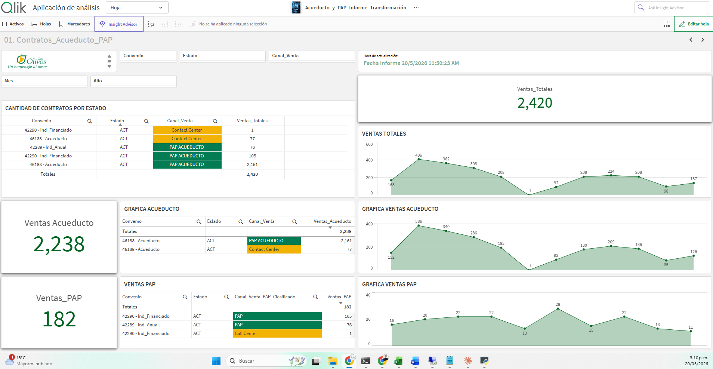
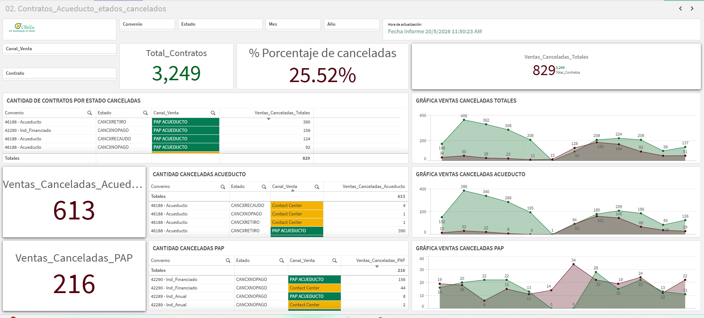
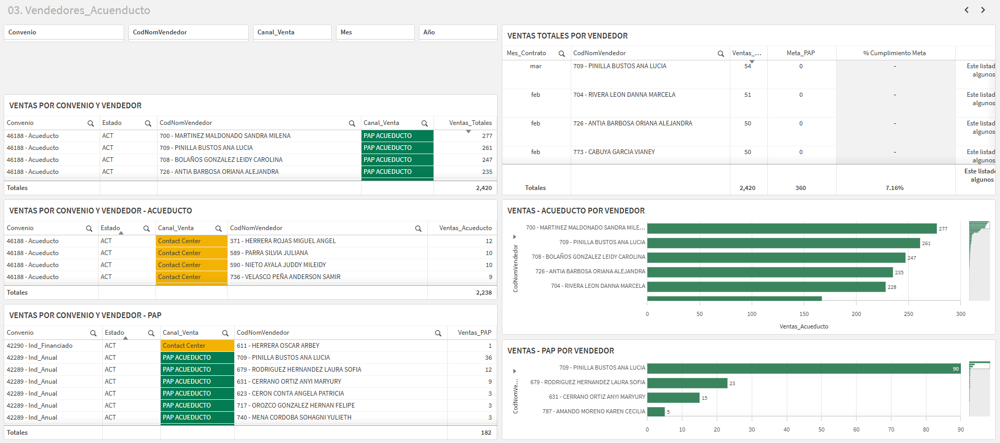
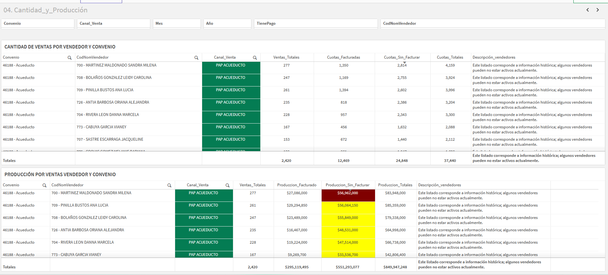
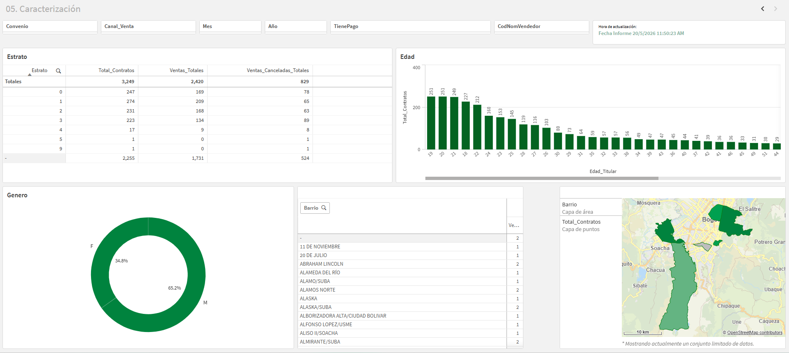

# App: Acueducto_y_PAP_Informe_Transformación

> Segunda app del [Tablero Acueducto y PAP](Tablero_Acueducto_y_PAP.md).
> Lee el QVD producido por
> [`Acueducto_y_PAP_Informe_Cargue`](Acueducto_y_PAP_Informe_Cargue.md),
> aplica reglas de transformación, clasifica canal de venta, calcula KPIs y
> publica 5 hojas de análisis al usuario final.

## Descripción funcional

> Reporte de ventas de Acueducto-PAP, donde están las transformaciones y
> seguimiento a los empleados por ventas en los diferentes canales. El
> presente reporte permite identificar las **ventas netas** del convenio
> con la **EAAB-ESP**; sin embargo, **no representa el estado de cierre
> mensual**.

## Identificación

| Campo | Valor |
|---|---|
| Nombre | `Acueducto_y_PAP_Informe_Transformación` |
| App ID (qDocId) | `f9047ec0-c8b9-4b14-ba82-3579359a8dca` |
| Stream | `PAP` |
| Creado | 4 dic 2025 17:46 |
| Publicado | 19 ene 2026 18:01 |
| Última recarga | Dinámica — encadenada con la app de Cargue |
| Tamaño app | 2 MiB |

## Entradas

| Insumo | Origen | Uso |
|---|---|---|
| `Acueducto_Ventas.qvd` | `lib://Extraccion (coopserfun_qlik)/` (publicado por app de Cargue) | Tabla principal de ventas |
| `bta_localidades.kml` | `lib://Mapas (coopserfun_qlik)/mapa_bogota/` | Polígonos de localidades de Bogotá (cruce por `Localidad`) |
| `Map_Barrio_Localidad.qvd` | `lib://Mapeo (coopserfun_qlik)/` (publicado por [`Map_Barrios_Bogota`](Map_Barrios_Bogota.md)) | Maestro oficial barrio→localidad (Datos Abiertos Bogotá) |

## Convenios manejados

| Convenio | Etiqueta interna | Origen | Clasificación |
|---|---|---|---|
| `46188` | `46188 - Acueducto` | Acueducto | Universo de Acueducto |
| `42289` | `42289 - Ind_Anual` | PAP | Universo PAP |
| `42290` | `42290 - Ind_Financiado` | PAP | Universo PAP |

## Estructura del script (tabs)

| # | Tab | Qué hace |
|---|---|---|
| 1 | `Main` | `SET` de formato Es-419 (igual que Cargue) |
| 2 | `Mapa` | Carga `bta_localidades.kml` con `Barrio`, `Area`, `Line` |
| 3 | `Convenio_acueducto_46188` | Aísla convenio 46188, sufija con `_Acueducto`, **multiplica `ValorContrato × 2`**, agrega `Total_Contratos_Acueducto` por contrato |
| 4 | `Convenio_PAP` | Aísla convenios 42289/42290, mapea vendedores válidos vs. Acueducto PAP, clasifica `Canal_Venta_PAP_Clasificado` |
| 5 | `Limpieza_estandarización_variables` | Re-lee el QVD completo, parsea números con `,` decimal y fechas `DD/MM/YYYY`, crea `Convenio_Etiqueta`, `Canal_Venta`, `AñoMes`, `Total_Valor_Contrato` |
| 6 | `Contratos_base` | LEFT JOIN del flag PAP a `Contratos_Base`, normaliza `Canal_PAP_Final`, concatena `CodNomVendedor`, **STORE final** |
| 7 | `Calendario` | Tabla inline `Calendario_Meses` (2025-07 → 2026-12) |
| 8 | `Metas_PAP` | Tabla inline `Metas_Mensuales` (2025-07 → 2025-12, todas con Meta_Mes = 60) |
| 9 | `Mapeo_Barrios` *(nuevo)* | Carga `Map_Barrio_Localidad.qvd` como mapping tables y aplica doble `ApplyMap` para enriquecer cada registro con `Localidad`. Detalle completo en [Map_Barrios_Bogota.md](Map_Barrios_Bogota.md) |

## Reglas de transformación clave

### R1 — ValorContrato del convenio Acueducto se multiplica por 2

```qlik
(ValorContrato * 2) AS ValorContrato_Acueducto
```

Solo se aplica al convenio `46188`. **Regla de negocio** — confirmar origen y vigencia.

### R2 — Clasificación de canal según `RefContrato`

```qlik
IF(LEN(TRIM(RefContrato)) > 0, 'PAP ACUEDUCTO', 'Contact Center') AS Canal_Venta_Acueducto
IF(LEN(TRIM(RefContrato)) > 0, 'PAP ACUEDUCTO', 'Call Center')    AS Canal_Venta_PAP
```

**Ojo**: el "no PAP" se etiqueta como `Contact Center` en Acueducto pero como `Call Center` en PAP. Misma fuente, etiqueta distinta — revisar consistencia.

### R3 — Filtro PAP por vendedores reales de Acueducto

```qlik
MAP_Vendedores_PAP:
MAPPING LOAD DISTINCT TEXT(CodVendedor_Acueducto), 1
RESIDENT Contratos_Acueducto
WHERE Canal_Venta_Acueducto = 'PAP ACUEDUCTO'
  AND MATCH(Estado_Acueducto, 'ACT', 'ACTFALLEC');

// luego, al filtrar PAP:
WHERE ApplyMap('MAP_Vendedores_PAP', TEXT(CodVendedor_PAP), 0) = 1
```

Solo se conservan los registros PAP cuyo vendedor también aparezca en Acueducto como PAP activo. Filtro cruzado entre universos.

### R4 — Clasificación interna PAP

```qlik
IF(
    LEN(TRIM(RefContrato_PAP)) > 1
    AND NOT MATCH(TRIM(RefContrato_PAP), '1', '0'),
    'PAP',
    'Call Center'
) AS Canal_Venta_PAP_Clasificado
```

Más estricto que R2: exige al menos 2 caracteres y que no sea `'0'` o `'1'`.

### R5 — Parseo de números con coma decimal

```qlik
NUM#(Replace(ValorContrato, ',', '.'))      AS ValorContrato
NUM#(Replace(Valor_Facturado, ',', '.'))    AS Valor_Facturado
NUM#(Replace(Valor_Sin_Facturar, ',', '.')) AS Valor_Sin_Facturar
NUM#(Replace(Ingreso_Recibido, ',', '.'))   AS Ingreso_Recibido
```

HANA entrega los importes como texto con `,` decimal; aquí se convierten a número.

### R6 — Fecha parseada y derivados

```qlik
Date(Date#(FechaInicioVigencia, 'DD/MM/YYYY')) AS FechaInicioVigencia
Day(FechaInicioVigencia)   AS Dia_Contrato
Month(FechaInicioVigencia) AS Mes_Contrato
Year(FechaInicioVigencia)  AS Anio_Contrato
Date(MonthStart(FechaInicioVigencia), 'YYYY-MM') AS AñoMes
```

### R7 — Total valor de contrato (multiplicación por cuotas)

```qlik
NUM#(Replace(ValorContrato, ',', '.')) * NUM(Cuotas) AS Total_Valor_Contrato
```

### R8 — Etiqueta de convenio legible

```qlik
IF(TEXT(Convenio)='42290','42290 - Ind_Financiado',
 IF(TEXT(Convenio)='42289','42289 - Ind_Anual',
 IF(TEXT(Convenio)='46188','46188 - Acueducto','OTRO'))) AS Convenio_Etiqueta
```

### R9 — Canal PAP final con default

```qlik
IF(
    LEN(TRIM(Canal_Venta_PAP_Clasificado)) = 0,
    'ACUEDUCTO',
    Canal_Venta_PAP_Clasificado
) AS Canal_PAP_Final
```

Para los registros que no entraron al universo PAP (mayoría del 46188), el canal final es `ACUEDUCTO`.

### R10 — Vendedor concatenado

```qlik
CodVendedor & ' - ' & NomVendedor AS CodNomVendedor
```

### R11 — Enriquecimiento Barrio → Localidad (nuevo)

Se agrega a partir de la app auxiliar [`Map_Barrios_Bogota`](Map_Barrios_Bogota.md).
Doble `ApplyMap`:

1. **Match exacto** sobre el barrio normalizado (`Upper+Trim+Replace`).
2. Si falla, **match por primera palabra** del barrio (atrapa "SUBA LOMBARDIA"→SUBA).
3. Si nada matchea, `Localidad = 'SIN_MAPEAR'`.

Se añade un segundo campo `Localidad_Fuente` con valores `EXACTO`,
`PRIMERA_PALABRA`, `SIN_MAPEAR` para trazabilidad. El TRACE del reload
imprime el top 20 de barrios que cayeron en `SIN_MAPEAR` para que el
analista los agregue a la tabla `Map_Excepciones` de la app auxiliar.

Código completo en [Map_Barrios_Bogota.md](Map_Barrios_Bogota.md#cambios-en-acueducto_y_pap_informe_transformación).

## Modelo de datos final

### Tabla principal: `Contratos_Base`

Campos resultantes (después del `RENAME TABLE Contratos_Base_Final TO Contratos_Base`):

| Categoría | Campos |
|---|---|
| Identificadores | `Contrato`, `Documento_Titular`, `CuentaContrato`, `RefContrato`, `Ciclo` |
| Estado | `Estado` |
| Vendedor | `CodVendedor`, `NomVendedor`, `CodNomVendedor` |
| Cuotas | `Cuotas`, `Cuotas_Facturadas`, `Cuotas_Sin_Facturar` |
| Importes | `Valor_Facturado`, `Valor_Sin_Facturar`, `Ingreso_Recibido`, `ValorContrato`, `Total_Valor_Contrato` |
| Pagos | `TienePago` |
| Demográficos | `Edad_Titular`, `Sexo`, `Estrato`, `Barrio`, `Localidad` *(nuevo)*, `Localidad_Fuente` *(nuevo)* |
| Fechas | `FechaInicioVigencia`, `Dia_Contrato`, `Mes_Contrato`, `Anio_Contrato`, `AñoMes` |
| Convenio | `Convenio`, `Convenio_Etiqueta` |
| Canal | `Canal_Venta`, `Canal_Venta_PAP_Clasificado`, `Canal_PAP_Final` |
| Conteo | `Total_Contratos` (= 1 por fila, sumable) |

### Tablas auxiliares

| Tabla | Origen | Filas | Uso |
|---|---|---|---|
| `bta_localidades` | KML Bogotá | Polígonos por localidad | Mapa por barrio |
| `Calendario_Meses` | INLINE | 18 (2025-07 → 2026-12) | Eje temporal en visualizaciones |
| `Metas_Mensuales` | INLINE | 6 (2025-07 → 2025-12) | KPI de meta de vendedores |

## Hojas publicadas

El app tiene **5 hojas** organizadas como flujo de análisis:

### Hoja 01 — Contratos_Acueducto_PAP



| Elemento | Detalle |
|---|---|
| Filtros | `Convenio`, `Estado`, `Canal_Venta` |
| KPIs | `Ventas Totales` (2.420) · `Ventas Acueducto` (2.238) · `Ventas PAP` (182) |
| Tablas | Cantidad de contratos por estado — por convenio, estado, canal |
| Gráficas | Series temporales: Ventas Totales / Ventas Acueducto / Ventas PAP |
| Métricas usadas | `SUM(Total_Contratos)` segmentado por `Convenio_Etiqueta` y `Canal_PAP_Final` |

### Hoja 02 — Estados_Cancelados



| Elemento | Detalle |
|---|---|
| Filtros | `Convenio`, `Estado`, `Mes`, `Año` |
| KPIs | `Total_Contratos` (3.249) · `% Porcentaje de canceladas` (25.52%) · `Ventas_Canceladas` total (829) |
| KPIs por universo | `Ventas_Canceladas_Acueducto` (613) · `Ventas_Canceladas_PAP` (216) |
| Tablas | Cantidad de contratos por estado cancelados — por convenio / canal |
| Gráficas | Series temporales de canceladas: Totales / Acueducto / PAP |
| Lógica | Estados de cancelación se identifican por `Estado` (no `ACT` ni `ACTFALLEC`) |

### Hoja 03 — Vendedores_Acueducto



| Elemento | Detalle |
|---|---|
| Filtros | `Convenio`, `CodNomVendedor`, `Canal_Venta`, `Mes`, `Año` |
| Tablas | Ventas por convenio y vendedor — separadas Acueducto y PAP |
| Gráficas | Barras horizontales: Ventas totales por vendedor + Ventas Acueducto por vendedor + Ventas PAP por vendedor |
| Cumplimiento | Cruza `Ventas_Vendedor` vs. `Meta_Mes` (de `Metas_Mensuales`) |

### Hoja 04 — Cantidad_y_Producción



| Elemento | Detalle |
|---|---|
| Filtros | `Convenio`, `Canal_Venta`, `Mes`, `Año`, `TienePago`, `CodNomVendedor` |
| Tabla superior | Cantidad de ventas por vendedor y convenio — `Cuotas_Facturadas`, `Cuotas_Sin_Facturar`, `Cuotas_Totales` + descripción |
| Tabla inferior | Producción por ventas vendedor y convenio — `Producción_Facturada` (=`SUM(Valor_Facturado)`), `Producción_Sin_Facturar` (=`SUM(Valor_Sin_Facturar)`) |
| Métricas usadas | `Valor_Facturado`, `Valor_Sin_Facturar`, `Cuotas_Facturadas`, `Cuotas_Sin_Facturar`, `Total_Contratos` |

### Hoja 05 — Caracterización



| Elemento | Detalle |
|---|---|
| Filtros | `Convenio`, `Canal_Venta`, `Mes`, `Año`, `TienePago`, `CodNomVendedor` |
| Tabla | Distribución por `Estrato` con conteos y % |
| Histograma | Distribución por `Edad_Titular` |
| Gráfica donut | Distribución por `Sexo` |
| Lista | Barrios con conteo de ventas |
| Mapa | Polígonos de localidades de Bogotá (cruce `Barrio` ↔ `bta_localidades.kml`) |

## KPIs / métricas resumidas

| KPI | Expresión Qlik (esperada) | Hoja donde aparece |
|---|---|---|
| Ventas Totales | `SUM(Total_Contratos)` | 01, 02 (canceladas) |
| Ventas Acueducto | `SUM({<Canal_PAP_Final={'ACUEDUCTO'}>} Total_Contratos)` | 01, 02 |
| Ventas PAP | `SUM({<Canal_PAP_Final={'PAP'}>} Total_Contratos)` | 01, 02 |
| % Canceladas | `SUM({<Estado={'<canceladas>'}>} Total_Contratos) / SUM(Total_Contratos)` | 02 |
| Producción Facturada | `SUM(Valor_Facturado)` | 04 |
| Producción Sin Facturar | `SUM(Valor_Sin_Facturar)` | 04 |
| Cumplimiento Meta | `SUM(Total_Contratos) / Meta_Mes` | 03 |

> _pendiente_: confirmar fórmulas exactas inspeccionando las medidas
> definidas en el script de visualización (no de carga).

## Salidas

| Archivo | Ruta |
|---|---|
| `Contratos_Base.csv` | `lib://Transformacion (coopserfun_qlik)/Contratos_Base.csv` |

## Issues conocidos / Riesgos detectados

### I1 — `Metas_Mensuales` solo cubre 2025-07 a 2025-12

`Metas_PAP` no tiene filas para 2026. Cualquier comparación de cumplimiento
del año en curso aparecerá sin meta. **Acción**: extender la tabla inline
o cambiarla por una fuente externa.

### I2 — `Calendario_Meses` es estático

Codificado inline hasta 2026-12. Hay que mantenerlo manualmente. Sugerido
generarlo con `AutoGenerate` o cargarlo desde un Excel/QVD compartido.

### I3 — Inconsistencia "Contact Center" vs "Call Center"

Mismo concepto, dos etiquetas distintas. Decidir cuál es la correcta y unificar.

### I4 — Regla `ValorContrato × 2` del convenio 46188

No documentada en el script. **Confirmar** con negocio el motivo (¿precio por
2 cementerios? ¿factor de provisión?) y si sigue vigente.

### I5 — Estado no filtrado en PAP

En `Convenio_PAP` el `WHERE Estado IN ('ACT','ACTFALLEC')` está comentado:
```qlik
// AND MATCH(Estado, 'ACT', 'ACTFALLEC'); <----verificar acá
```
Hoy entran TODOS los estados al universo PAP. Decidir si es intencional.

### I6 — `MAP_Vendedores_PAP` no se elimina con `DROP MAPPING TABLE`

```qlik
// DROP MAPPING TABLE MAP_Vendedores_PAP;
```
Está comentado. No es bloqueante pero ensucia el cache del app.

### I7 — Variable `FechaInicioVigencia` definida en Cargue se pierde

La variable se define en la app de Cargue pero no se persiste al QVD,
así que la app de Transformación no la ve.

### I8 — Descripción del app advierte que NO es estado de cierre mensual

El propio reporte indica: _"no representa el estado de cierre mensual"_.
Importante difundir esto a los consumidores del tablero para evitar que
lo usen como fuente de cifras oficiales mensuales.

## Bitácora de cambios al script de transformación

| Fecha | Cambio | Por |
|---|---|---|
| 2026-05-20 | Documentación inicial generada a partir del script y screenshots | _pendiente_ |
